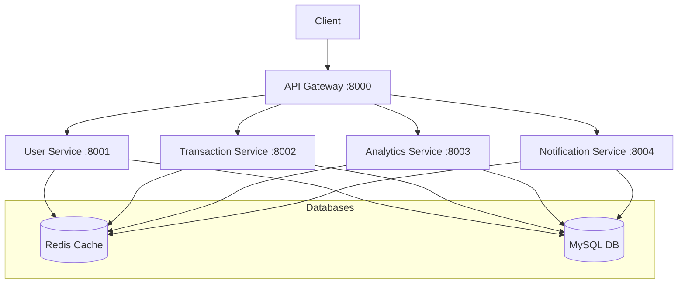

# Finance Management Microservices

클라우드 네이티브 과제로 제출하기 위한,
클라우드 네이티브 환경에서 운영되는 금융 관리 마이크로서비스 애플리케이션

## api
# Financial Service API Documentation

## 1. User Profile API
Base URL: `/user_service/profile`

### 1.1 회원가입
- **Endpoint**: POST `/register`
- **Description**: 새로운 사용자를 등록합니다
- **Request Body**:
  ```json
  {
    "email": "user@example.com",     // 필수, 이메일 형식
    "password": "password123",       // 필수, 최소 6자 이상
    "alias": "username"             // 필수, 닉네임
  }
  ```
- **Response**: ProfileResponse
  ```json
  {
    "id": 1,
    "email": "user@example.com",
    "alias": "username"
  }
  ```
- **Status Codes**:
  - 200: 성공
  - 400: 잘못된 요청
  - 409: 이미 존재하는 사용자

### 1.2 로그인
- **Endpoint**: POST `/login`
- **Description**: 사용자 인증 후 세션 ID를 반환합니다
- **Request Body**:
  ```json
  {
    "email": "user@example.com",     // 필수, 이메일 형식
    "password": "password123"        // 필수
  }
  ```
- **Response**:
  ```json
  {
    "sessionId": "unique-session-id"
  }
  ```
- **Status Codes**:
  - 200: 성공
  - 401: 인증 실패

### 1.3 로그아웃
- **Endpoint**: POST `/logout`
- **Description**: 현재 세션을 종료합니다
- **Headers**: 
  - X-Session-ID: 세션 ID (필수)
- **Response**: 없음
- **Status Codes**:
  - 200: 성공
  - 401: 유효하지 않은 세션

### 1.4 프로필 조회
- **Endpoint**: GET `/me`
- **Description**: 현재 로그인한 사용자의 프로필 정보를 조회합니다
- **Headers**: 
  - X-Session-ID: 세션 ID (필수)
- **Response**: ProfileResponse
- **Status Codes**:
  - 200: 성공
  - 401: 유효하지 않은 세션
  - 404: 프로필을 찾을 수 없음

## 2. Category API
Base URL: `/transaction_service/categories`

### 2.1 카테고리 생성
- **Endpoint**: POST `/`
- **Description**: 새로운 카테고리를 생성합니다
- **Headers**:
  - X-USER-ID: 사용자 ID (필수)
- **Request Body**:
  ```json
  {
    "content": "식비"    // 필수
  }
  ```
- **Response**: CategoryResponse
  ```json
  {
    "id": 1,
    "content": "식비",
    "createdAt": "2024-01-01T12:00:00"
  }
  ```
- **Status Codes**:
  - 200: 성공
  - 400: 잘못된 요청 데이터
  - 401: 인증 실패

### 2.2 카테고리 목록 조회
- **Endpoint**: GET `/`
- **Description**: 사용자의 모든 카테고리 목록을 조회합니다
- **Headers**:
  - X-USER-ID: 사용자 ID (필수)
- **Response**: CategoryListResponse
  ```json
  {
    "categories": [
      {
        "id": 1,
        "content": "식비",
        "createdAt": "2024-01-01T12:00:00"
      }
    ],
    "totalCount": 1
  }
  ```
- **Status Codes**:
  - 200: 성공
  - 401: 인증 실패

### 2.3 카테고리 수정
- **Endpoint**: PUT `/{categoryId}`
- **Description**: 기존 카테고리의 정보를 수정합니다
- **Headers**:
  - X-USER-ID: 사용자 ID (필수)
- **Request Body**:
  ```json
  {
    "content": "수정된 식비"    // 필수
  }
  ```
- **Response**: CategoryResponse
- **Status Codes**:
  - 200: 성공
  - 400: 잘못된 요청 데이터
  - 401: 인증 실패
  - 404: 카테고리를 찾을 수 없음

### 2.4 카테고리 삭제
- **Endpoint**: DELETE `/{categoryId}`
- **Description**: 지정된 카테고리를 삭제합니다
- **Headers**:
  - X-USER-ID: 사용자 ID (필수)
- **Response**: 없음
- **Status Codes**:
  - 204: 성공
  - 401: 인증 실패
  - 404: 카테고리를 찾을 수 없음

## 3. Transaction API
Base URL: `/transaction_service/transactions`

### 3.1 거래내역 생성
- **Endpoint**: POST `/`
- **Description**: 새로운 거래내역을 생성합니다
- **Request Body**:
  ```json
  {
    "transactionType": "INCOME",           // 거래 유형
    "amount": 50000,                       // 금액
    "description": "급여",                 // 설명
    "date": "2024-01-01T12:00:00",        // 거래 일자
    "categoryIds": [1, 2]                  // 카테고리 ID 목록
  }
  ```
- **Response**: TransactionResponse
  ```json
  {
    "id": 1,
    "profileId": 1,
    "transactionType": "INCOME",
    "amount": 50000,
    "description": "급여",
    "date": "2024-01-01T12:00:00",
    "categories": [
      {
        "id": 1,
        "content": "급여",
        "createdAt": "2024-01-01T12:00:00"
      }
    ],
    "createdAt": "2024-01-01T12:00:00",
    "updatedAt": "2024-01-01T12:00:00"
  }
  ```
- **Status Codes**:
  - 200: 성공
  - 400: 잘못된 요청 데이터
  - 401: 인증 실패

### 3.2 거래내역 조회
- **Endpoint**: GET `/{id}`
- **Description**: 특정 거래내역의 상세 정보를 조회합니다
- **Response**: TransactionResponse
- **Status Codes**:
  - 200: 성공
  - 401: 인증 실패
  - 404: 거래내역을 찾을 수 없음

### 3.3 사용자 거래내역 목록 조회
- **Endpoint**: GET `/profile`
- **Description**: 현재 로그인한 사용자의 모든 거래내역을 조회합니다
- **Response**: TransactionListResponse
  ```json
  {
    "transactions": [
      {
        "id": 1,
        "profileId": 1,
        "transactionType": "INCOME",
        "amount": 50000,
        "description": "급여",
        "date": "2024-01-01T12:00:00",
        "categories": [],
        "createdAt": "2024-01-01T12:00:00",
        "updatedAt": "2024-01-01T12:00:00"
      }
    ],
    "totalCount": 1
  }
  ```
- **Status Codes**:
  - 200: 성공
  - 401: 인증 실패

### 3.4 거래내역 수정
- **Endpoint**: PUT `/{id}`
- **Description**: 기존 거래내역의 정보를 수정합니다
- **Request Body**: TransactionUpdateRequest (생성 요청과 동일한 형식)
- **Response**: TransactionResponse
- **Status Codes**:
  - 200: 성공
  - 400: 잘못된 요청 데이터
  - 401: 인증 실패
  - 404: 거래내역을 찾을 수 없음

### 3.5 거래내역 삭제
- **Endpoint**: DELETE `/{id}`
- **Description**: 지정된 거래내역을 삭제합니다
- **Response**: 없음
- **Status Codes**:
  - 200: 성공
  - 401: 인증 실패
  - 404: 거래내역을 찾을 수 없음

## 인증
모든 API는 다음과 같은 인증 방식을 사용합니다:

1. 로그인하여 세션 ID를 발급받습니다
2. 모든 요청의 헤더에 세션 ID를 포함시켜야 합니다
   - X-Session-ID: 세션 ID
3. 일부 API의 경우 사용자 ID도 헤더에 포함해야 합니다
   - X-USER-ID: 사용자 ID

## 에러 응답
모든 에러 응답은 다음과 같은 형식을 따릅니다:
```json
{
  "status": 400,
  "message": "에러 메시지",
  "timestamp": "2024-01-01T12:00:00"
}
```

## 시스템 아키텍처



## 기술 스택

- **Framework:** Spring Boot
- **Database:** MySQL
- **Cache:** Redis
- **Container:** Docker
- **API Gateway:** Spring Cloud Gateway
- **Documentation:** Swagger/OpenAPI
- **Build Tool:** Gradle/Maven

## 시작하기

### 사전 요구사항
- Docker
- Docker Compose
- JDK 17+
- Maven 또는 Gradle

### 실행 방법

1. 프로젝트 클론
```bash
git clone https://github.com/yourusername/finance-microservices.git
```

2. 서비스 빌드
```bash
./gradlew clean build
```

3. 도커 컨테이너 실행
```bash
docker-compose up -d
```

4. 서비스 접속
- API Gateway: http://localhost:8000
- Swagger UI: http://localhost:8000/swagger-ui.html

## 프로젝트 구조
```
project-root/
├── api-gateway/
├── user-service/
├── transaction-service/
├── analytics-service/
├── notification-service/
├── docker-compose.yml
└── README.md
```

## 도메인 설명
### API Gateway (:8000)
- 라우팅 설정
- 인증/인가 필터
- 로드 밸런싱
```
├── api-gateway/
│   ├── src/main/java/com/finance/gateway/
│   │   ├── GatewayApplication.java
│   │   └── config/
│   │       └── RouteConfig.java
│   └── Dockerfile
```
### User Service (회원 도메인:8001)
- 사용자 관리
- 인증/인가
- 프로필 관리
- 알림 설정 관리

```
user-service/
├── src/main/java/com/finance/user/
│   ├── controller/
│   │   ├── UserController.java
│   │   └── AuthController.java
│   ├── service/
│   │   ├── UserService.java
│   │   └── AuthService.java
│   ├── repository/
│   │   └── UserRepository.java
│   ├── domain/
│   │   ├── User.java
│   │   └── UserPreference.java
│   └── dto/
│       ├── UserDTO.java
│       └── AuthDTO.java
```

### Transaction Service (거래 도메인:8002)

- 수입 관리
- 지출 관리
- 거래 내역 기록
- 카테고리 관리
```
Transaction Service
├── src/main/java/com/finance/transaction/
│   ├── controller/
│   │   ├── IncomeController.java
│   │   └── ExpenseController.java
│   ├── service/
│   │   ├── TransactionService.java
│   │   └── CategoryService.java
│   ├── repository/
│   │   ├── TransactionRepository.java
│   │   └── CategoryRepository.java
│   ├── domain/
│   │   ├── Transaction.java
│   │   └── Category.java
│   └── dto/
│       ├── TransactionDTO.java
│       └── CategoryDTO.java
```
### Analytics Service (분석 도메인:8003)

- 월별 지출 분석
- 카테고리별 분석
- 예산 대비 지출 분석
- 지출 패턴 분석
```
analytics-service/
├── src/main/java/com/finance/analytics/
│   ├── controller/
│   │   ├── BudgetAnalysisController.java
│   │   └── SpendingAnalysisController.java
│   ├── service/
│   │   ├── AnalyticsService.java
│   │   └── ReportService.java
│   ├── repository/
│   │   └── AnalyticsRepository.java
│   ├── domain/
│   │   ├── BudgetAnalysis.java
│   │   └── SpendingPattern.java
│   └── dto/
│       ├── AnalyticsDTO.java
│       └── ReportDTO.java
```
### Notification Service (알림 도메인:8004)

- 예산 초과 알림
- 월간 리포트 발송
- 중요 지출 알림
- 알림 이력 관리
```
notification-service/
├── src/main/java/com/finance/notification/
│   ├── controller/
│   │   └── NotificationController.java
│   ├── service/
│   │   ├── NotificationService.java
│   │   └── EmailService.java
│   ├── repository/
│   │   └── NotificationRepository.java
│   ├── domain/
│   │   ├── Notification.java
│   │   └── NotificationPreference.java
│   └── dto/
│       └── NotificationDTO.java
```

## 데이터베이스 구성

### MySQL
- Database: finance_db
- 각 서비스별 독립적인 스키마 사용
- 포트: 3306

### Redis
- 세션 관리 및 캐싱
- 포트: 6379

## API 문서
각 서비스의 API 문서는 Swagger UI를 통해 확인할 수 있습니다:
- User Service: http://localhost:8001/swagger-ui.html
- Transaction Service: http://localhost:8002/swagger-ui.html
- Analytics Service: http://localhost:8003/swagger-ui.html
- Notification Service: http://localhost:8004/swagger-ui.html

## 제출 시에
- 1,2 번 항목은 가능하다면, 컨테이너 구성 등의 방법을 캡쳐해서 제출
- 결과만 캡쳐하고 코드는 스냥 파일로 제출하면 됨
- 도커 관련 파일은 그냥 허브에 올리면 됨
- 용량이 정 부족하다 싶으면 구글 드라이브에 올려서 링크 공유 가능
